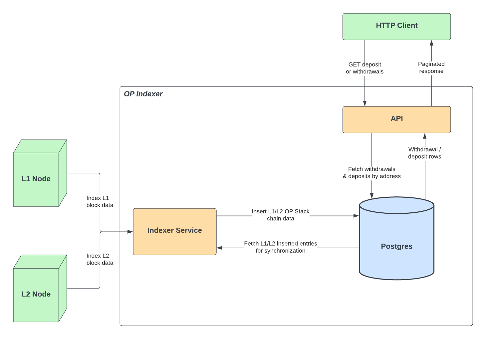
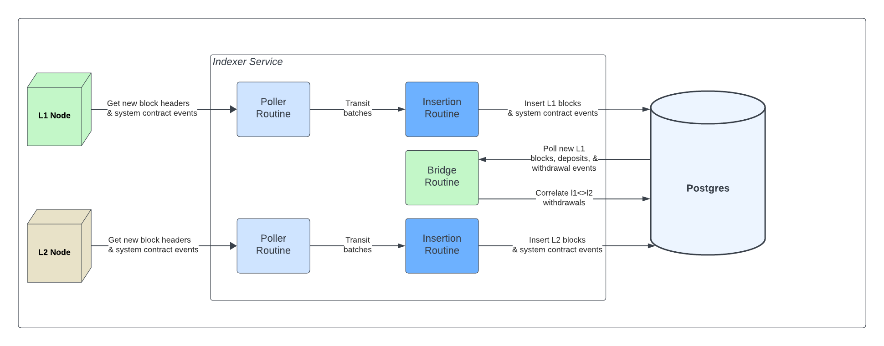

# @eth-optimism/indexer

## Getting started

### Setup env
The `indexer.toml` stores a set of preset environmental variables that can be used to run the indexer with the exception of the network specific `l1-rpc` and `l2-rpc` variables. The `indexer.toml` file can be ran as a default config, otherwise a custom `.toml` config can provided via the `--config` flag when running the application. An optional `l1-starting-height` value can be provided to the indexer to specify the L1 starting block height to begin indexing from. This should be ideally be an L1 block that holds a correlated L2 genesis commitment. Furthermore, this value must be less than the current L1 block height to pass validation. If no starting height value is provided and the database is empty, the indexer will begin sequentially processing from L1 genesis.

### Setup polling intervals
The indexer polls and processes batches from the L1 and L2 chains on a set interval/size. The default polling interval is 5 seconds for both chains with a default batch header size of 500. The polling frequency can be changed by setting the `l1-polling-interval` and `l2-polling-interval` values in the `indexer.toml` file. The batch header size can be changed by setting the `l1-batch-size` and `l2-batch-size` values in the `indexer.toml` file.

### Testing
All tests can be ran by running `make test` from the `/indexer` directory.  This will run all unit and e2e tests.

**NOTE:** Successfully running the E2E tests requires spinning up a local L1 geth node and pre-populating it with necessary bedrock genesis state.  This can be done by calling `make devnet-allocs` from the root of the optimism monorepo before running the indexer tests. More information on this can be found in the [op-e2e README](../op-e2e/README.md).

### Run indexer vs goerli

- install docker
- `cp example.env .env`
- fill in .env
- run `docker compose up` to start the indexer vs optimism goerli network

### Run indexer with go

See the flags in `flags.go` for reference of what command line flags to pass to `go run`

### Run indexer vs devnet

TODO add indexer to the optimism devnet compose file (previously removed for breaking CI)

### Run indexer vs a custom configuration

`docker-compose.dev.yml` is git ignored.   Fill in your own docker-compose file here.

## Architecture

The indexer application supports two separate services for collective operation:
**Indexer API** - Provides a lightweight API service that supports paginated lookups for bridge events.
**Indexer Service** - A polling based service that constantly reads and persists OP Stack chain data (i.e, block meta, system contract events, synchronized bridge events) from a L1 and L2 chain.

### Indexer API
TBD

### Indexer Service

The indexer service is responsible for polling and processing real-time batches of L1 and L2 chain data. The indexer service is currently composed of the following key components:
- **Poller Routines** - Individually polls the L1/L2 chain for new blocks and OP Stack system contract events.
- **Insertion Routines** - Awaits new batches from the poller routines and inserts them into the database upon retrieval.
- **Bridge Routine** - Polls the database directly for new L1 blocks and bridge events. Upon retrieval, the bridge routine will:
* Process and persist new bridge events
* Synchronize L1 proven/finalized withdrawals with their L2 initialization counterparts

### L1 Polling
L1 blocks are only indexed if they contain L1 system contract events. This is done to reduce the amount of unnecessary data that is indexed. Because of this, the `l1_block_headers` table will not contain every L1 block header.

#### API
The indexer service runs a lightweight health server adjacently to the main service. The health server exposes a single endpoint `/healthz` that can be used to check the health of the indexer service. The health assessment doesn't check dependency health (ie. database) but rather checks the health of the indexer service itself.

### Database
The indexer service currently supports a Postgres database for storing L1/L2 OP Stack chain data. The most up-to-date database schemas can be found in the `./migrations` directory.

## Metrics
The indexer services exposes a set of Prometheus metrics that can be used to monitor the health of the service. The metrics are exposed via the `/metrics` endpoint on the health server.

## Prerequisites
Before launching an instance of the service, ensure you have the following:
- A postgres database configured with user/password credentials.
- Access to RPC endpoints for archival layer1 and layer2 nodes.
- Access to at least two server instances with sufficient resources (TODO - Add resource reqs).
- Use of a migration procedure for applying database schema changes.
- Telemetry and monitoring configured for the service.

## Security
All security related issues should be filed via github issues and will be triaged by the team. The following are some security considerations to be taken when running the service:
- Since the Indexer API only performs read operations on the database, access to the database for any API instances should be restricted to read-only operations.
- The API has no rate limiting or authentication/authorization mechanisms. It is recommended to place the API behind a reverse proxy that can provide these features.
- Postgres connection timeouts are unenforced in the services. It is recommended to configure the database to enforce connection timeouts to prevent connection exhaustion attacks.

## Troubleshooting
Please advise the [troubleshooting](./docs/troubleshooting.md) guide for common failure scenarios and how to resolve them.
